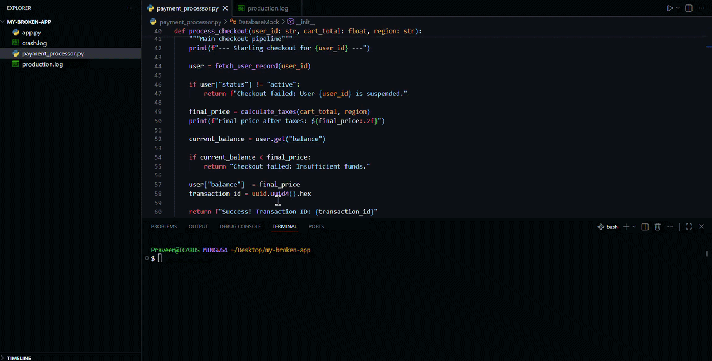
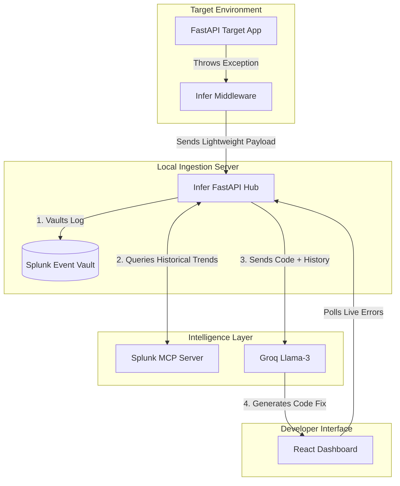

# Infer RCA



## Overview 

Infer is a observability and diagnostic agent. It separates application execution from error tracking, utilizing a zero-configuration AST parser, content-addressed file caching, and Splunk MCP integration to autonomously diagnose backend failures.

Infer is designed for complex, distributed environments. The Python middleware captures exceptions and hashes source code. The standalone FastAPI hub securely routes telemetry to Splunk via the HTTP Event Collector (HEC). When a developer requests a diagnosis via the React Flow frontend, the agent queries the Splunk MCP Server for historical context before utilizing Groq (Llama-3.3-70b) to generate a source-level fix.

---

### Architecture Diagram



---

## System Architecture

Infer operates across three distinct layers:

1. **Client Agent (Middleware):** An asynchronous ASGI middleware that intercepts exceptions, hashes files, and extracts context without blocking the main event loop.
2. **Local Ingestion Server (Hub):** A FastAPI server (`localhost:5050`) that maintains state, manages the local file cache, and communicates with Splunk.
3. **Intelligence Layer:** An orchestration system that merges historical Splunk data (via MCP), local source code, and ChromaDB vector memory into a comprehensive prompt for the Groq inference engine.

---

## Tech Stack

**Core Backend & Middleware:**
* **Python 3.x**
* **FastAPI & Uvicorn:** Asynchronous ingestion server and API routing.
* **Starlette & Requests:** Non-blocking target app middleware and HTTP transport.

**Intelligence & Observability Layer:**
* **Splunk Enterprise & MCP:** HTTP Event Collector (HEC) for secure log vaulting and Model Context Protocol for historical trend queries.
* **Groq API:** Fast inference utilizing the `llama-3.3-70b-versatile` model.
* **ChromaDB & LangChain:** Local vector database for semantic traceback caching.
* **Google Generative AI:** `gemini-embedding-001` for accurate error signature matching.

**Frontend Interface:**
* **React.js & Vite:** Fast, local client rendering.
* **React Flow:** Dynamic, regex-free microservice topology mapping.
* **Tailwind CSS:** Minimalist, dark-mode component styling.
---

## Core Engineering Capabilities

### 1. Content-Addressed File Caching
Transmitting entire source files on every error is inefficient. Infer middleware generates SHA-256 hashes of all files in a traceback. The ingestion server checks its local cache and only requests file uploads if the hash is unrecognized, drastically reducing network overhead.

### 2. Splunk MCP Historical Integration
A standard LLM cannot know if an error is a one-off anomaly or a systemic issue. When a diagnosis is triggered, Infer uses the Splunk Model Context Protocol (MCP) to query the Splunk database via SPL. It retrieves the frequency and history of the specific error type and injects this context into the LLM prompt.

### 3. Regex-Free Architecture Mapping
The React frontend visualizes the backend architecture dynamically. Instead of brittle regex parsing, the backend utilizes Python's native `ast` library to map `Import` and `ImportFrom` nodes, generating a deterministic microservice graph for React Flow.

---

## Repository Structure

```text
infer-rca/
├── infer_rca/                  # Core Agent Service
│   ├── main.py                 # FastAPI application entry point
│   ├── routers.py              # Ingestion, Handshake, and Diagnosis routes
│   ├── splunk_client.py        # Splunk HEC integration
│   ├── splunk_mcp.py           # Splunk Historical Search integration
│   ├── agent.py                # Groq and ChromaDB execution
│   └── graph_builder.py        # AST parsing logic
│
├── frontend/                   # React Flow Dashboard
│   ├── src/
│   └── package.json
│
├── sandbox1/                    # Target applications for testing
├── sandbox2/ 
│
└── requirements.txt

```

---

## Installation & Setup

### 1. Environment Configuration

Clone the repository and set up the core infrastructure keys:

```bash
git clone https://github.com/icarus5851/infer-rca.git
cd infer-rca
touch infer_rca/.env

```
Create and activate a virtual environment in the root directory:
```bash
python -m venv venv
source venv/bin/activate  # On Windows: source venv/Scripts/activate
```
Install dependencies from the root directory:
```bash
pip install -r requirements.txt
```

Define the following in `infer_rca/.env`:

```text
GROQ_API_KEY=your_groq_api_key
GEMINI_API_KEY=your_gemini_api_key

```

### 2. Splunk Configuration

1. Launch Splunk Enterprise locally.
2. Enable the **HTTP Event Collector (HEC)** in Global Settings.
3. Create a new token and insert it into `infer_rca/splunk_client.py`.
4. Update your Splunk administrative credentials in `infer_rca/splunk_mcp.py` to allow historical search queries.

### 3. Service Initialization

You must run the frontend and backend concurrently.

**Terminal 1 (Backend Agent):**

```bash
cd infer_rca
python main.py

```

**Terminal 2 (Frontend UI):**

```bash
cd frontend
npm install
npm run dev

```

### 4. Instrumenting a Target Application

Attach the tracer middleware to any FastAPI application. You can find this in `sandbox1/target_app.py`

```python
import hashlib
import os
import uuid
import uvicorn
import traceback
import requests
from fastapi import FastAPI, Request
from auth import verify_user
from starlette.middleware.base import BaseHTTPMiddleware

class InferTracerMiddleware(BaseHTTPMiddleware):
    async def dispatch(self, request: Request, call_next):
        trace_id = uuid.uuid4().hex[:8] 
        
        try:
            response = await call_next(request)
            success_payload = {
                "trace_id": trace_id,
                "status": "success",
                "endpoint": request.url.path,
                "event": "200 OK" # For Splunk
            }
            try:
                requests.post("http://localhost:5050/ingest-success", json=success_payload, timeout=0.5)
            except Exception:
                pass
                
            return response
            
        except Exception as e:
            error_trace = traceback.format_exc()
            extracted_tb = traceback.extract_tb(e.__traceback__)

            file_inventory = {} 
            files_payload = []  
            processed_filepaths = set()

            for frame in extracted_tb:
                filepath = frame.filename
                
                if "site-packages" in filepath or "venv" in filepath or filepath.startswith("<"):
                    continue
                
                clean_filename = os.path.basename(filepath)
                
                if filepath in processed_filepaths:
                    continue
                processed_filepaths.add(filepath)

                try:
                    with open(filepath, "r", encoding="utf-8") as f:
                        content = f.read()
                        
                    file_hash = hashlib.sha256(content.encode('utf-8')).hexdigest()
                    
                    file_inventory[file_hash] = {
                        "filename": clean_filename,
                        "filepath": filepath,
                        "content": content,
                        "hash": file_hash
                    }
                    
                    files_payload.append({
                        "filename": clean_filename,
                        "filepath": filepath,
                        "hash": file_hash
                    })
                except Exception:
                    continue 

            primary_crashed_file = files_payload[-1]["filename"] if files_payload else "Unknown"

            log_payload = {
                "trace_id": trace_id,
                "endpoint": request.url.path,
                "error_type": type(e).__name__,
                "traceback": error_trace,
                "primary_crashed_file": primary_crashed_file,
                "files": files_payload 
            }
            
            print("\n" + "="*60)
            print(f"[INFER] Crash Intercepted | Trace-ID: {trace_id}")
            print(f"[INFER] Primary File: {primary_crashed_file}")
            print("="*60 + "\n")
            
            try:
                response = requests.post("http://localhost:5050/ingest", json=log_payload, timeout=5)
                
                if response.status_code == 200:
                    agent_data = response.json()
                    missing_hashes = agent_data.get("missing_hashes", [])
                    
                    if missing_hashes:
                        print(f"[INFER] Agent requested {len(missing_hashes)} missing files. Uploading...")
                        
                        code_payload = {
                            "trace_id": trace_id,
                            "missing_files": [
                                file_inventory[h] for h in missing_hashes if h in file_inventory
                            ]
                        }
                        requests.post("http://localhost:5050/upload-code", json=code_payload, timeout=5)
                        
            except requests.exceptions.RequestException as req_err:
                print(f"[INFER-WARNING] Connection failed: {req_err}")
            
            raise e

app = FastAPI()
app.add_middleware(InferTracerMiddleware)

```


### Important: Configuring the Target Directory
By default, the React architecture map scans a folder named `sandbox1` located one level above the agent. If you are testing with different directory names (e.g., `sandbox1`, `sandbox2`), you must manually point the AST parser to your new folder.

To do this, open `infer_rca/routers.py`, locate the `@api_router.get("/graph-data")` endpoint (around line 115), and change the folder name:

```python
# Change "sandbox" to the name of your target directory
target_directory = os.path.join(current_dir, "..", "sandbox1") 

```

---


Access the React dashboard at `http://localhost:5173` to view the live architecture map, monitor the log trail, and trigger AI-assisted root cause analysis.
