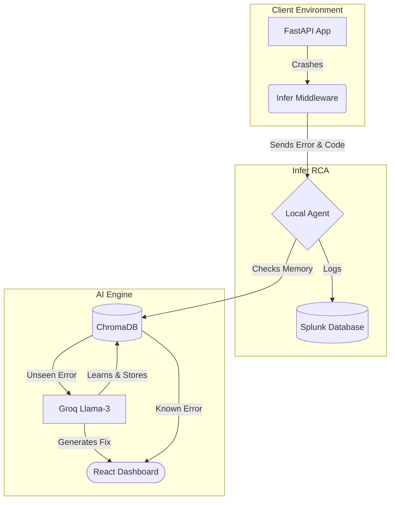

# Infer RCA

Infer is an observability tool that separates application execution from error tracking and diagnostics.

It uses a non-blocking FastAPI middleware to capture exceptions directly from running applications. It then securely forwards these logs to a local Splunk database via the HTTP Event Collector (HEC) and uses a Groq-powered LLM engine to analyze the full source code and generate exact fixes.

### Project Status: Active Development

Infer is currently undergoing architectural updates. The core Python ingestion server and AI diagnostic engine are functional. I am building a web-based UI using React Flow to replace the terminal interface. This frontend will map microservices visually and integrate directly with the Splunk MCP (Model Context Protocol) Server for asynchronous log retrieval.

---

## System Architecture

Infer consists of three distinct local layers:

1. **Client Agent (Middleware):** An asynchronous ASGI middleware added to the target web application codebase.
2. **Local Ingestion Server (Hub):** A FastAPI server running independently on `localhost:5050` to receive error streams.
3. **Intelligence Layer (AI Brain):** A stateful runtime utilizing a local ChromaDB vector database and the Groq inference engine (`llama-3.3-70b-versatile`).

### Data Flow Diagram



---

## Core Engineering Challenges Solved

### 1. Credential Abstraction

* **Problem:** Hardcoding analytics or AI API keys directly inside the client code creates security risks and tightly couples business logic to specific tracking tools.
* **Solution:** Infer abstracts vendor configuration. The client middleware only needs the local address of the ingestion server (`http://localhost:5050/ingest`). The standalone local agent handles all secure upstream data transport and credentials.

### 2. Context Extraction

* **Problem:** Standard error tracebacks lack the context needed for LLMs to diagnose complex bugs (e.g., missing dictionary keys or invalid states).
* **Solution:** The Infer middleware extracts the native traceback at the exact moment of failure, reads the failing file directly from the local disk, and injects the raw source code along with the traceback into the JSON payload.

### 3. Token Optimization

* **Problem:** High-traffic applications can generate thousands of identical errors, leading to unsustainable LLM API costs and rate limits.
* **Solution:** Infer uses Google Gemini embeddings and a local ChromaDB instance to perform vector similarity lookups on every raw traceback. If a known error signature is detected, the remediation strategy is instantly fetched from the local disk, bypassing external API calls entirely.

---

## Repository Layout

```text
infer-rca/
├── infer_rca/                  # Core Python Ingestion Service
│   ├── __init__.py             
│   ├── agent.py                # Listens on localhost:5050; routes to Splunk & AI
│   ├── ai_engine.py            # ChromaDB lookup & Groq 70B reasoning agent
│   └── .env                    # Secure local environment keys(see .env.example)
│
├── frontend/                   # React Flow web visualizer (In Progress)
│   ├── src/
│   ├── package.json
│   └── vite.config.js
│
└── requirements.txt

```

---

## Installation & Usage Guide

### 1. Configure the Local Environment

Clone the repository and set up your core infrastructure configurations inside the `/infer_rca` module:

```bash
# Clone and enter directory
git clone https://github.com/icarus5851/infer-rca.git
cd infer-rca

# Create environment configuration
touch infer_rca/.env

```

Add your API keys to `infer_rca/.env` like `.env.example`:

```text
GROQ_API_KEY=your_groq_api_key_here
GEMINI_API_KEY=your_gemini_api_key_here

```

### 2. Configure Splunk (Local Vault)

1. Launch Splunk Enterprise locally at `http://localhost:8000`.
2. Navigate to **Settings > Data Inputs > HTTP Event Collector**.
3. Select **Global Settings**, configure all tokens to **Enabled**, verify the standard transport port is set to `8088`, and save.
4. Click **New Token**, name it `infer-rca-token`, finalize the setup, and paste the generated token directly into `infer_rca/agent.py`.

### 3. Launch the Local Ingestion Server

Start the local agent to begin listening for incoming error streams on port 5050:

```bash
cd infer_rca
python agent.py

```

### 4. Instrument a Target App

To connect an existing FastAPI microservice to Infer, append the custom middleware hook:

```python
from fastapi import FastAPI
from starlette.middleware.base import BaseHTTPMiddleware
from target_app import InferTracerMiddleware 

app = FastAPI()
# Automatically catches exceptions and routes them to localhost:5050
app.add_middleware(InferTracerMiddleware)

@app.get("/checkout/{user_id}")
async def run_checkout(user_id: str):
    # Core app logic here...
    return {"status": "processing"}

```

```python
class InferTracerMiddleware(BaseHTTPMiddleware):
    async def dispatch(self, request: Request, call_next):
        trace_id = uuid.uuid4().hex[:8] 
        
        try:
            response = await call_next(request)
            return response
            
        except Exception as e:
            error_trace = traceback.format_exc()
            tb_info = traceback.extract_tb(e.__traceback__)[-1]
            crash_filename = tb_info.filename
            
            crashed_code = "Code could not be extracted."
            try:
                with open(crash_filename, "r", encoding="utf-8") as f:
                    crashed_code = f.read()
            except Exception:
                pass
            
            log_payload = {
                "trace_id": trace_id,
                "endpoint": request.url.path,
                "error_type": type(e).__name__,
                "traceback": error_trace,
                "crashed_code": crashed_code
            }
            
            print("\n" + "="*60)
            print(f"[INFER] Crash Intercepted | Trace-ID: {trace_id}")
            print(f"[INFER] Endpoint: {log_payload['endpoint']}")
            print(f"[INFER] Error Type: {log_payload['error_type']}")
            print("="*60)
            print(log_payload['traceback'])
            print("="*60 + "\n")
            
            # Transmit the payload to the Infer CLI Agent
            try:
                requests.post("http://localhost:5050/ingest", json=log_payload, timeout=2)
            except requests.exceptions.RequestException:
                print("[INFER-WARNING] Could not connect to Infer Agent at localhost:5050")
            
            raise e
```

When an unhandled exception occurs, the middleware intercepts it, logs the record into Splunk over HTTPS (`localhost:8088`), runs a ChromaDB similarity check, and outputs the resolution inside the terminal.