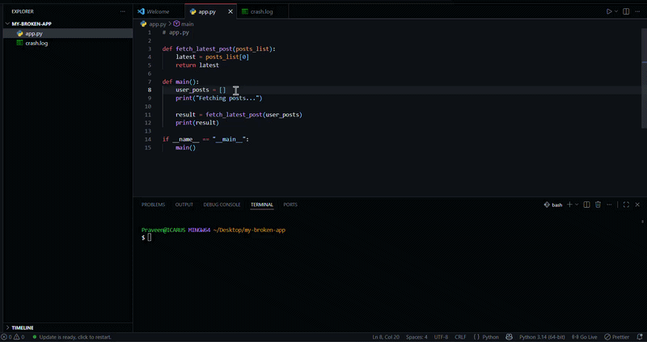

# Infer



**Infer** is an AI-powered, globally installed CLI tool that acts as a local debugging assistant. It parses messy server logs, dynamically extracts the exact Python code context where the crash occurred, and generates root cause analyses and fixes using Google's Gemini 2.5 Flash model. 

It features a local **ChromaDB Vector Database** to cache previously solved errors, ensuring instant responses for recurring bugs without wasting API tokens.

## Features

* **Automated Log Parsing:** Reads raw terminal logs and identifies fatal stack traces using Regex.
* **Context-Aware Code Extraction:** Calculates exact line numbers from the trace and automatically opens local files to extract the surrounding code context.
* **Local RAG Memory Bank:** Caches stack traces and AI-generated solutions in a local ChromaDB vector database. If an error happens twice, the solution loads instantly.
* **Beautiful Terminal UI:** Uses the `rich` library to render syntax-highlighted code blocks, loading animations, and Markdown-formatted AI responses.

## Technology Stack

* **Language:** Python
* **LLM Engine:** Google Gemini API (`google-genai`)
* **Vector Database & Embeddings:** ChromaDB & LangChain (`langchain-chroma`, `langchain-google-genai`)
* **User Interface:** Rich (`rich`)

## Installation & Setup

**1. Clone the repository:**
```bash
git clone [https://github.com/icarus5851/infer-rca.git](https://github.com/icarus5851/infer-rca.git)
cd infer-rca
```
**2. Set up a Virtual Environment (Recommended):**
```bash
python -m venv venv
source venv/Scripts/activate # On Windows
```

**3. Install Dependencies:**
```bash
pip install -r requirements.txt
```

**4. Set up your Environment Variables:**
Create a `.env` file in the root directory and add your Gemini API key (you can reference `.env.example`):
```text
GEMINI_API_KEY=your_api_key_here
```

**5. Install Globally:**
Install the tool as a global CLI command on your system:
```bash
pip install -e .
```

## Usage

Once installed globally, you can run `infer` from any directory on your machine to analyze a broken log file.

```bash
infer path/to/your/server.log
```