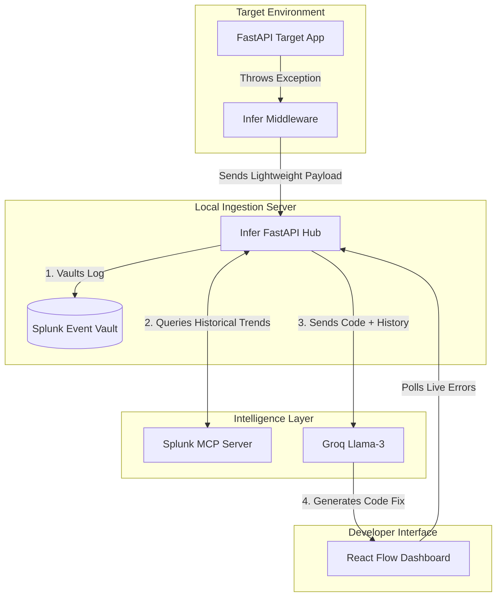

```mermaid
graph TD
    subgraph Target Environment
        APP[FastAPI Target App] -->|Throws Exception| MW[Infer Middleware]
    end

    subgraph Local Ingestion Server
        MW -->|Sends Lightweight Payload| HUB[Infer FastAPI Hub]
        HUB -->|1. Vaults Log| HEC[(Splunk Event Vault)]
    end

    subgraph Intelligence Layer
        HUB <--->|2. Queries Historical Trends| MCP[Splunk MCP Server]
        HUB -->|3. Sends Code + History| AI[Groq Llama-3]
    end

    subgraph Developer Interface
        UI[React Flow Dashboard] -->|Polls Live Errors| HUB
        AI -->|4. Generates Code Fix| UI
    end

```